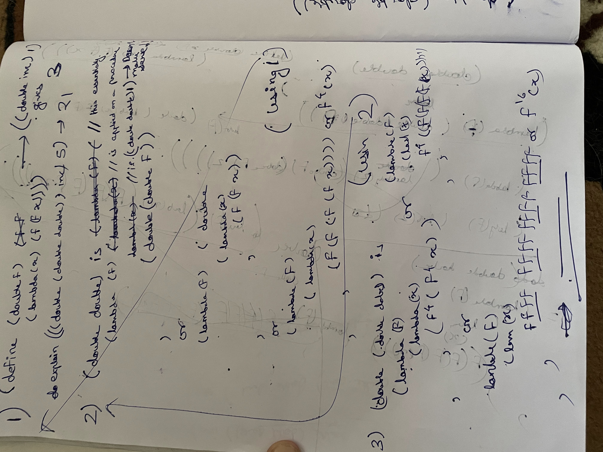
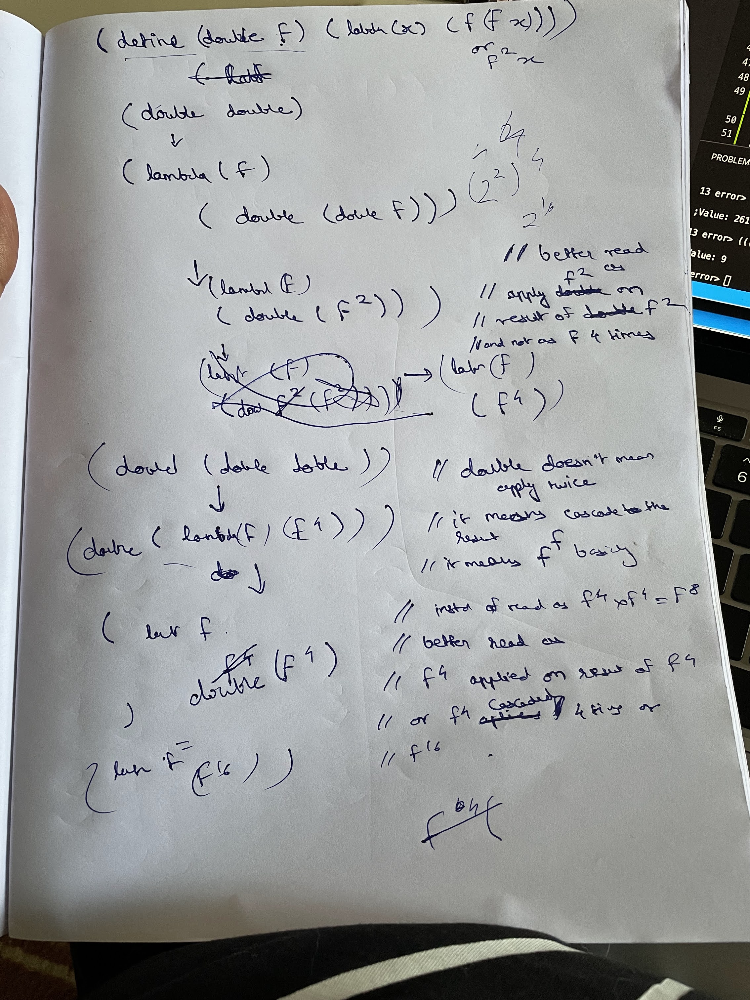

# SICP Exercies

Hey, I am just learning [in a bigger scheme of things](https://web.mit.edu/6.001/6.037/sicp.pdf). 

[Great He](https://codology.net/)

## Comments

1-3 - write largest two without using min
1-4 - if/else over operation? is it function or data?
1-16 and 1-18 teaches to use loop invariant.

1-26 and 1-28 - exponentiation and prime

1-29 - high order functions for integration. in here I was trying to define h as a function but ended up defining a local variable. Soon realised they are same in this context. Moment of Truth(MOT)!!

1-30 - extended 1-29 but then formed another function twoFunEqual which seems like magic now. It is hard to differ a function from data. MOT2

1-32 - accumulator - third order function. 

1-39 - forces to create a speacial lambda which is just a dummy. tan-cf becomes a half implementation of cont-frac. Almost like an interface implementation. 

sqrt - It is real thing to understand this. Like what does it mean to return a procedure. Imagine looking at average-damp or derivative as to when return is a value and when it is a procedure. 

1-41 - A challenge for the understanding. 

A simpler to understand proof is here

But a more sound proof is 

See this proof. in proof_1-41.jpg. 

Let's notice some important things. 
    - double, (double double) and (double (double double)). All three of them, always maintained their functional nature which is the same as that of double. why? it's because double in its definition ensures this.
    
    - They were always a procedure      
        - which took only one argument which is again a procedure - returned a procedure which is of same nature as that of argument procedure. 

    - Notice a stark difference between inc and double. 
        - inc can only be applied on data. and double can only be applied on procedure. 
        - double argument's Nature of procedure is that it should take only one argument. in a way double itself takes only one argument therefore (double double) is valid!! and (double double) also takes and outputs a function of one argument so (double (double double)) or ((double double) (double double)) are all valid. Amazing thing to notice is double is quite non-chalant. 

        - Like (double 1), (double (inc 2)) or (inc double) are all meaningless.  (inc (inc 1)) and (double (double inc)) both make sense.(double double) makes sense but (inc inc) or ((inc 1) (inc 1)) doesn't. 

    - (double inc) would return a procedure of some functional nature as inc (i.e it can only be applied to data)

    - (double double) whould also adhere to it and so would (double (double double)). with inc's context, double returns a procedure which can work on data (like inc itself). (double double) 
    should adhere to nature of double so (double double) returns a procedure which can work on data. and similarily (double (double double)) should adhere to nature of (double double) and therefore it also returns a procedure which can work on data. 

1-42 (captured inside 1-43.scm) - 
    introduces a compose function. 
    (define (compose f g)
        (lambda (x) (f (g x)))
    )
    It takes two procedures and returns a procedure. All of three procedures in picture takes only 1 argument. 

    - Like double from previous example, you can't use it for procedures with 0 or more than 1 arguments. 

    - double is a speacial case of compose. (define (doublei f) (compose f f))

    - If it returns a function, it would always be explicit. like definition of compose has lambda as return object, doublei has return of compose (which is a procedure) and like this below
        (define (doubleii f) 
            (define (doubleii_util x)
                (f (f x))
            )
            doubleii_util
        ) 
    
    - again compose and inc are very different. (compose compose) is find but (inc inc) is not. inc forces its arguments to be data and compose forces it to be procedure. It is because internally inc uses + which wants data. compose is just too unopinionated. 

    - ((compose square inc) 2) worked but ((compose double inc) 2) would not. Because of internals of compose. In compose f g, output of g should be like input of f. Similarily in double, 
    input of f and output of f must be of same nature. 
    - (((compose double double) inc) 5) works 

1-43 - A recursive order function. Understand how one can make nth order procedures. One idea is to always keep in mind the function signature. A procedure returning a procedure will always return a signature. Also I have done  both iterative and recursive version of repeated but know this that there is no difference. In fact, on ((double inc) 2), (double inc) is "expanded" before using any value of 2. This is done by interpreter. It is basically done normal-order instead of applicative-order(which is used everywhere else for evaluating). 

1-44 - this use of repeated from previous exercise blew my mind. use it as a receipe for procedure

## abstrating data

2-1 - *compound data* - rational numbers as a compound data
2-2 - line segments and points as compound data
2-3 - *data can themselves express ideas* - here area and perimeter are ideas which are independent of rectangle representatio
2-5 - *data as just data* - compound data pair as an integer. sweet work. 
2-6 - *data as a procedure* - in fact, a second order procedure.

2-8 to 2-12 - solidification of abstract data types and their behaviour.
2-17 to 2-23 - sequences - simplest heirchical structures
2-23 to 2-29 - introduce tree and map over lists - a more complex form of heirchical structure. 
2-30 and 2-31 - map over tree

